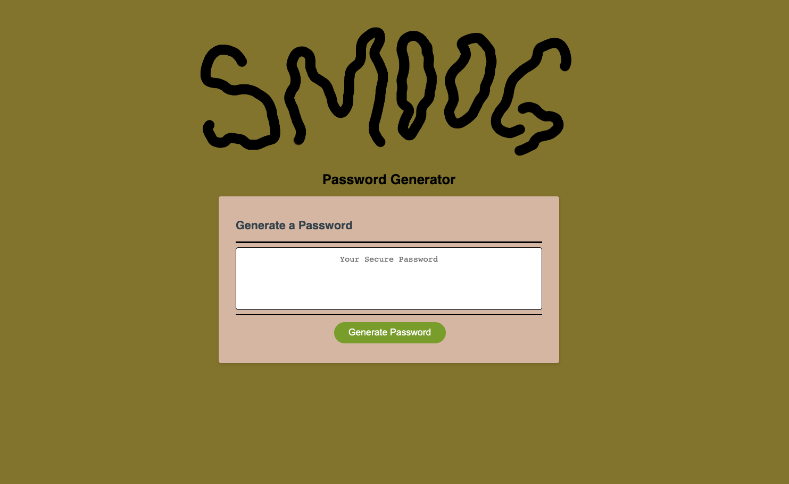
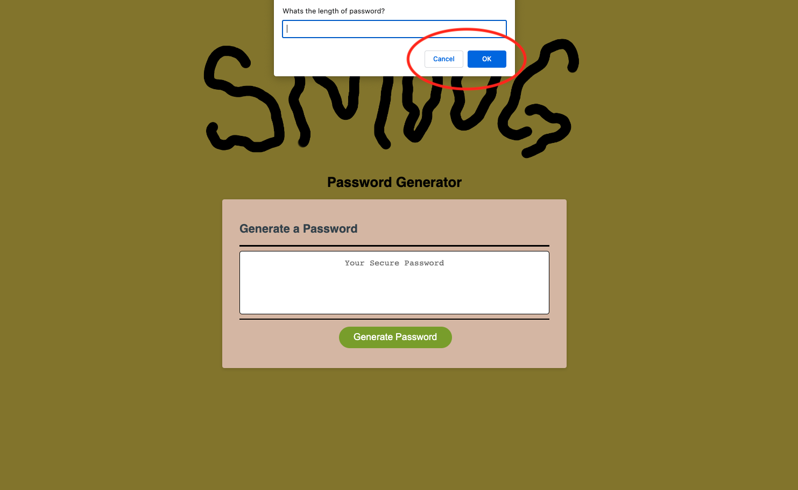
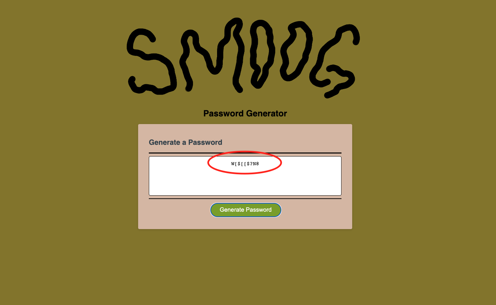

# SMOOG RANDOM PASSWORD GENERATOR 
## Jayné M. Valverde
This weeks challange was a lot harder than I thought it would be. I realize now, especially with JavaScript, small practice sessions every day is going to be a crucial part of me getting through the rest of these assisgnment.  
 
One of my biggest hurdles is understanding how the *for loops* work, but I know with some practice I will feel more and more comfortable. (maybe making my own generators on my spare time)  
Another confusing portion for me was udnerstanding how the *functions* work along side with the **variations**.   
But again, after some tutoring and discussion with fellow students, I think I have a slight better understanding of how they relate to one another.  
 
The **assignment codes** & **event listeners** are something I am going to have to go over again in my spare time and possibly get a little more tutoring on. 
 
## The Password Generator 
I was able to get get all the criteria met as far as prompting password questions.
* length 
* special characters
* numers
* uppercase/lowercase  

I wasnt able to get it to keep generating password based on the original set of questions.  
Everytime you hit, *Generate Password* it starts the questions all over again. 
 
## Screenshot's of Website w/ Generator 

 Main loading page when loading the site.   
 I also, included a hero image cause I love fun fonts for boring websites.

 Here I have circled the first funciton prompt that allows the user to imput 
 a length criteria.

 Here I have circled the *generated password* that is pushed through after the user answers all 5 password criteria questions.

 ## Resources

 **Juan Delgado**:  
 from my weekly tutor sessions has been a great help on this project. 
 He did a phenominal job at guidng me through finding my own solutions with out just giving me  
 the answers outright. I have a better udnerstanding of how this specific JavaScript code works because of it. 

 **Sarh Squyres**:  
 is a student with me in this program. When I was stuck on figuring out my *for loops*  
 she shared what she had learned from her tutoring sessions.   
 She did a great job as walking me through how her *for loops* worked and how I can inpliment it in my own code. 

 **Mia** *(from ask-BCS)*:  
 This was my first time using ask-BCS and she responded quickly and concisely on my questions  
 I went to her when I had all of my code finally written out and what I thought should be functional.  
 When I couldn't get it to work, she looked at it for me and noticed slight errors that I had missed  
 Mostly they were syntax errors and problems with me copy/pasting my own code and having unnecessary duplicates.

 **Ron Bailey**:  
 Ron, our instructor gave us a rough outline of what the code **should** look like. 
 It was a good jump off point for a lot of us who had no idea where to start.  
 He didn't give us crucial answers but just a rough idea of what needs to be set up. 
